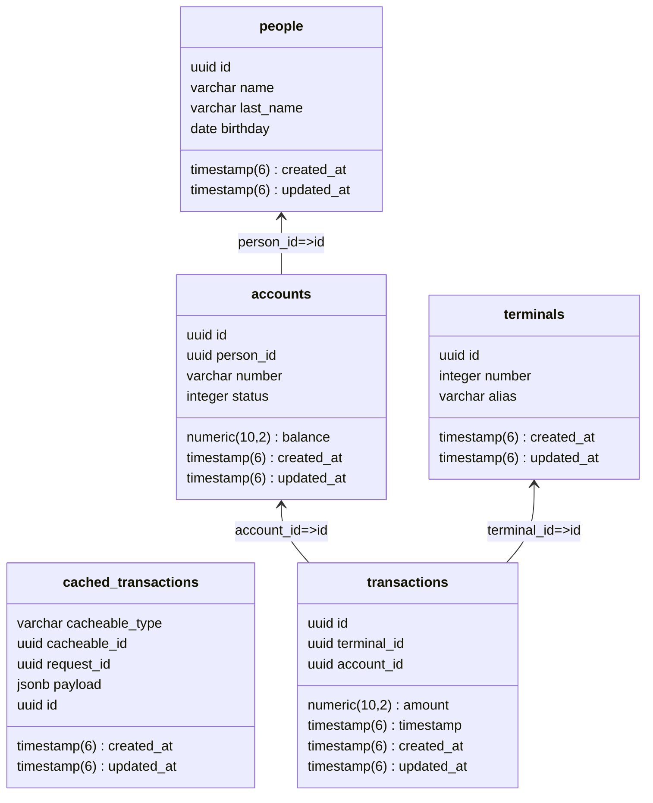

# FinanceAPI

This is a sample of a RESTful API for a financial system developed using Ruby on Rails.

The main purpose of this project is serving as a study case for the impact of using idempotency
  to prevent duplicate requests in a financial system.

The API is split in two versions: v1 and v2. The v1 version is the one that does not use idempotency
  and the v2 version is the one that uses idempotency.

## Data structure

The API has the following data structure:

A person is a single customer of the financial institution. A person might have multiple accounts.

An account is a single account of a person. An account might have multiple transactions.

A terminal is a single terminal of the financial institution. It represents an interface for the financial institution.
  It may be a physical terminal (like an ATM or pinpad) or a virtual terminal (Online transaction).

The entity cached_transactions is used to store the requests that have been processed by the API. This is used to prevent
  duplicate requests in the system when using the idempotency mechanism. 

## API structure

The API has the following endpoints for both version (V1 and V2):

**People**:

* GET */api/{version}/people* : List all people
* GET */api/{version}/people/:id* : Show a person
* POST */api/{version}/people* : Create a person
* PATCH */api/{version}/people/:id* : Update a person
* DELETE */api/{version}/people/:id* : Delete a person

**Accounts**:

* GET */api/{version}/accounts* : List all accounts
* GET */api/{version}/accounts/:id* : Show an account
* POST */api/{version}/accounts* : Create an account
* PATCH */api/{version}/accounts/:id* : Update an account

**Terminals**:

* GET */api/{version}/terminals* : List all terminals
* GET */api/{version}/terminals/:id* : Show a terminal
* POST */api/{version}/terminals* : Create a terminal
* PATCH */api/{version}/terminals/:id* : Update a terminal

**Transactions**:

* GET */api/{version}/transactions* : List all transactions
* GET */api/{version}/transactions/:id* : Show a transaction
* POST */api/{version}/transactions* : Create a transaction
